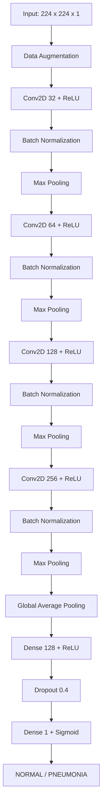

<div align="center">

# 🫁 Pneumonia Detection from Chest X-Ray Images Using CNN


**A custom Convolutional Neural Network for binary classification of chest X-ray images into NORMAL and PNEUMONIA classes.**

**Author:** Md. Atik Hasan Rahat  

</div>

---

## 📌 Project Overview

Pneumonia is a respiratory infection that can be identified using chest radiographs. This project develops a **Convolutional Neural Network (CNN)** to automatically classify chest X-ray images into two categories:

- **NORMAL**
- **PNEUMONIA**

The project includes dataset exploration, preprocessing, stratified train-validation splitting, data augmentation, class-imbalance handling, CNN implementation, model training, evaluation, and prediction visualization.

> **Note:** This project is developed for academic and educational purposes. It is **not intended for clinical diagnosis or medical decision-making**.

---

## 🎯 Objective

The main objective is to build and evaluate a CNN-based medical image classification model capable of learning discriminative features from chest X-ray images and detecting pneumonia with high sensitivity.

---

## 📂 Dataset

The project uses the publicly available **Chest X-Ray Images (Pneumonia)** dataset from Kaggle.

### Original Dataset Distribution

| Split | NORMAL | PNEUMONIA | Total |
|---|---:|---:|---:|
| Training | 1,341 | 3,875 | 5,216 |
| Validation | 8 | 8 | 16 |
| Test | 234 | 390 | 624 |

The original validation set contains only 16 images, which is too small for reliable model monitoring. Therefore, the original training set was re-split using an **80:20 stratified split**.

### Final Training Setup

| Split | NORMAL | PNEUMONIA | Total |
|---|---:|---:|---:|
| Training | 1,073 | 3,099 | 4,172 |
| Validation | 268 | 776 | 1,044 |
| Test | 234 | 390 | 624 |

The official test set remained completely independent and was used only for final evaluation.

---

## 🔄 Project Workflow

```mermaid
flowchart LR
    A[Chest X-Ray Dataset] --> B[Exploratory Data Analysis]
    B --> C[Stratified Train / Validation Split]
    C --> D[Resize to 224 x 224]
    D --> E[Grayscale + Normalization]
    E --> F[Data Augmentation]
    F --> G[Class Weighting]
    G --> H[Custom CNN]
    H --> I[Model Training]
    I --> J[Validation Monitoring]
    J --> K[Test Evaluation]
    K --> L[Predictions + Visualizations]
```



---

## 🧹 Data Preprocessing

Each X-ray image is processed before being passed to the model:

- Converted to **grayscale**
- Resized to **224 × 224 pixels**
- Pixel values normalized to the **[0, 1]** range
- TensorFlow `tf.data` pipeline used for efficient loading
- Batch size set to **32**
- Prefetching enabled with `tf.data.AUTOTUNE`

### Data Augmentation

Mild augmentation was applied only to the training images:

- Random rotation: `0.02`
- Random zoom: `0.05`
- Random translation: `0.05`
- Random contrast: `0.10`
- No horizontal flipping, because left-right orientation can be anatomically meaningful in chest X-rays

---

## ⚖️ Handling Class Imbalance

The dataset contains considerably more pneumonia images than normal images. To reduce bias toward the majority class, balanced class weights were used during training.

| Class | Weight |
|---|---:|
| NORMAL | 1.9441 |
| PNEUMONIA | 0.6731 |

---

## 🧠 CNN Architecture

The model is a **custom CNN** containing four convolutional blocks followed by global average pooling and fully connected layers.



### Model Summary

<p align="center">
  
</p>

The network contains approximately **422,785 parameters**, of which **421,825 are trainable** and **960 are non-trainable**.

---

## ⚙️ Training Configuration

| Setting | Value |
|---|---|
| Input Size | 224 × 224 × 1 |
| Optimizer | Adam |
| Initial Learning Rate | 0.001 |
| Loss Function | Binary Cross-Entropy |
| Batch Size | 32 |
| Maximum Epochs | 20 |
| Dropout | 0.40 |
| Output Activation | Sigmoid |
| Early Stopping | Enabled |
| ReduceLROnPlateau | Enabled |
| Model Checkpoint | Enabled |

The model was trained with class weights to address the class imbalance. Early stopping and learning-rate reduction were used to reduce overfitting and improve convergence.

---

## 📈 Training Performance

<p align="center">
  
  
</p>

The model showed strong learning performance on the training data, while validation performance fluctuated during training. The best model checkpoint was saved based on validation loss.

---

## 📊 Test Results

The trained CNN was evaluated on the independent test set containing **624 chest X-ray images**.

| Metric | Score |
|---|---:|
| Accuracy | **67.79%** |
| Precision | **66.21%** |
| Recall / Sensitivity | **98.97%** |
| F1-Score | **79.34%** |
| ROC-AUC | **91.11%** |
| NORMAL Recall / Specificity | **15.81%** |

### Confusion Matrix

<p align="center">
  
</p>

The confusion matrix contains:

- **37** normal images correctly classified as NORMAL
- **197** normal images incorrectly classified as PNEUMONIA
- **4** pneumonia images incorrectly classified as NORMAL
- **386** pneumonia images correctly classified as PNEUMONIA

The model achieved **very high sensitivity for pneumonia**, detecting almost all pneumonia cases. However, it also produced many false-positive predictions for normal X-rays, indicating that the default decision threshold strongly favors the PNEUMONIA class.

---

## 🔍 Sample Predictions

<p align="center">
  
</p>

The sample predictions demonstrate how the CNN assigns labels and confidence scores to unseen chest X-ray images from the test set.

---

## 🧪 Evaluation Metrics

Because the dataset is imbalanced, model performance was evaluated using more than accuracy alone:

- **Accuracy** — overall proportion of correct predictions
- **Precision** — proportion of predicted pneumonia cases that were truly pneumonia
- **Recall / Sensitivity** — ability to correctly detect pneumonia cases
- **F1-Score** — balance between precision and recall
- **ROC-AUC** — ability to separate the two classes across different thresholds
- **Confusion Matrix** — detailed analysis of correct and incorrect classifications

---

## 💡 Key Findings

- The CNN successfully learned useful features from chest X-ray images.
- Pneumonia recall reached approximately **98.97%**, meaning very few pneumonia cases were missed.
- The probability-based ROC-AUC was approximately **91.11%**, indicating useful class-separation ability across thresholds.
- Performance at the default `0.5` threshold was strongly biased toward predicting pneumonia.
- NORMAL recall was only **15.81%**, showing a high false-positive rate for normal images.
- Further threshold tuning and model improvement are required for a more balanced classifier.

---

## 🚀 Future Improvements

Potential extensions of this project include:

- Validation-based decision-threshold optimization
- Transfer learning with models such as EfficientNet, ResNet, or DenseNet
- Hyperparameter tuning
- Improved augmentation strategies
- Grad-CAM visualization for explainability
- Model calibration
- External validation using an independent chest X-ray dataset
- Patient-level splitting when patient identifiers are available

---

## 🗂️ Repository Structure

```text
Pneumonia-Detection-CNN/
│
├── Pneumonia_Detection_CNN.ipynb
├── README.md
│
├── assets/
│   ├── model_architecture.png
│   ├── training_validation_accuracy.png
│   ├── training_validation_loss.png
│   ├── confusion_matrix.png
│   └── sample_predictions.png
│
└── report/
    └── Pneumonia_Detection_CNN_Report.docx
```

---

## ▶️ How to Run

### 1. Clone the Repository

```bash
git clone YOUR_GITHUB_REPOSITORY_URL
cd Pneumonia-Detection-CNN
```

### 2. Install Required Libraries

```bash
pip install tensorflow numpy pandas matplotlib scikit-learn kagglehub
```

### 3. Open the Notebook

```bash
jupyter notebook Pneumonia_Detection_CNN.ipynb
```

Alternatively, upload the notebook directly to **Google Colab** and execute the cells sequentially.

---

## 🛠️ Technologies Used


---

## 👨‍💻 Author

<div align="center">

### Md. Atik Hasan Rahat

**Deep Learning • Computer Vision • Medical Image Classification**

[](YOUR_GITHUB_PROFILE_URL)

</div>

---

## ⚠️ Disclaimer

This project is intended solely for **academic and educational purposes**. The model has not been clinically validated and must not be used as a substitute for professional medical diagnosis, radiological assessment, or clinical decision-making.

---

<div align="center">

### ⭐ If you find this project useful, consider starring the repository.


**Made with 🧠 Deep Learning and 🫁 Medical Imaging**

</div>
